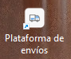

# Shipping-platform
Proyecto de coordinadora de gestión de envíos, creado con el framework de Next.js y React.
Se utiliza context api para la estructura y envío de datos entre los componentes y 
el uso de Server Side Rendering (SSR). El proyecto solo tiene dos pantallas una de búsqueda de guías y 
la otra visualizará el detalle de la guía consultada. 
Para el manejo de ramas se utilizo git flow permitiendo la creación de la ramas dev, test y main la principal,
y ramas features entre cada cambio generado. 

## Características

- En el proyecto se integro:
  - En el navbar se tomo el link del logo de coordinadora
  - Renderizado del lado del servidor (SSR)
  - Uso de context API
  - Enrutamiento
  - Permite instalarse en dispositivos móviles con PWA creando un archivo llamado manifest.json
  - Para el diseño de la página se utilizo Material UI y CSS
 
## Tecnologías

- **Next.js**: Framework de React para la creación de aplicaciones web.
- **React**: Librería de JavaScript para construir interfaces de usuario.
- **Material UI**: Biblioteca de componentes para permitir el diseño de la página.

## ¿Cómo instalar el proyecto?

1. **Clona el repositorio**:
   ```bash
   git clone https://github.com/DianaRobayo/shipping-platform.git

2. **Para correr el repositorio**:
```bash
npm run dev
# or
yarn dev
# or
pnpm dev
# or
bun dev
```

De forma local la aplicación se inicia en [http://localhost:3000](http://localhost:3000) .

3. **Para instalar la app en móvil**:
En la pantalla principal aparece un icono de descarga e instalación móvil y el nombre del archivo se nombro 
'Plataforma de envios' como se muestra en la siguiente imagen.



## Deploy on Vercel
This project uses [`next/font`](https://nextjs.org/docs/app/building-your-application/optimizing/fonts) to automatically optimize and load [Geist](https://vercel.com/font), a new font family for Vercel.

The easiest way to deploy your Next.js app is to use the [Vercel Platform](https://vercel.com/new?utm_medium=default-template&filter=next.js&utm_source=create-next-app&utm_campaign=create-next-app-readme) from the creators of Next.js.

Check out our [Next.js deployment documentation](https://nextjs.org/docs/app/building-your-application/deploying) for more details.
